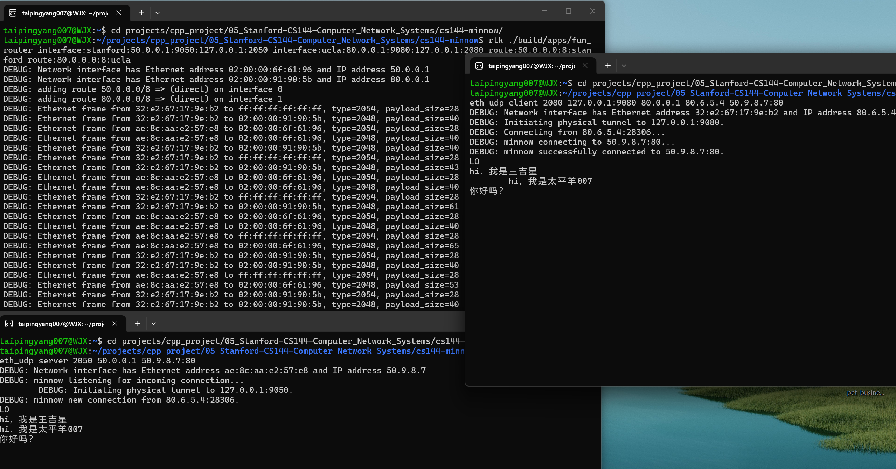

# CS144 — TCP/IP 协议栈实现（现代 C++ 从零实现）


> 用现代 C++ 从零实现 TCP/IP 协议栈（可靠字节流 → TCP → IP/ARP → 路由），并在自建仿真网络（IP-in-Ethernet-in-UDP 隧道）上跑通**端到端 TCP 通信**。约 1k 行核心实现（`src/`），各 checkpoint 单元测试全绿、UBSan / ASan 无未定义行为。

**技术深度集中在三处**，每处都配可点击的代码锚点：

1. **TCP 可靠传输** — 滑动窗口、超时重传（指数退避）、32↔64 位序号回绕。
2. **协议栈封装与转发** — IP / 以太网封装解封、ARP 地址解析与缓存、最长前缀匹配路由。
3. **端到端联调与逐包分析** — 自建仿真网络跑通真实通信，可逐包解读握手 / 重传 / 挥手。

## 核心亮点 · Highlights

### 1. TCP 可靠传输：滑动窗口 + 超时重传 + 序号回绕

实现 TCP 发送端的滑动窗口与超时重传：按对端通告窗口发送、累积确认推进窗口左沿；`tick` 触发最早未确认段重传，连续超时**翻倍退避**，且**收到推进 ACK 才重置定时器与退避计数**（零窗口探测不计入退避）。序号在网络上是 32 位、会回绕，内部统一用 **64 位 absolute seqno** 作无歧义坐标、借 checkpoint 就近还原——其中**序号回绕与定时器边界**最易出现 off-by-one 与误重置。

代码：[`tick`](src/tcp_sender.cc#L101) · [`push`](src/tcp_sender.cc#L15) · [`receive`](src/tcp_sender.cc#L72) · [`Wrap32::wrap/unwrap`](src/wrapping_integers.cc#L6)

### 2. 字节流重组：乱序 / 重叠 / 重复 → 有序流

`Reassembler` 把网络无序交付的字节段按 stream index **区间合并**为连续流：重叠裁剪、重复丢弃、容量边界与 EOF 标志，再推进入站字节流。难点集中在**重叠区间的裁剪与去重**——多一字节、少一字节都会破坏有序流的正确性。

代码：[`Reassembler::insert`](src/reassembler.cc#L5) · [`TCPReceiver::receive`](src/tcp_receiver.cc#L5)

### 3. 协议栈封装 + ARP + 最长前缀匹配路由

`NetworkInterface` 在 IP 数据报与以太网帧间封装 / 解封并实现 **ARP**：缓存命中直发，未命中广播请求 + 数据报入队待发，缓存 30s 过期、pending 去重、学到映射后冲刷队列。`Router` 做**最长前缀匹配**转发，附带 TTL 递减与首部校验和重算。一个易错点：LPM 须按 **bit** 而非按字节匹配，且 `/0` 默认路由的掩码 `~0u << 32` 是移位 UB、必须特判——正是 sanitizer 会当场抓住的点。

代码：[`send_datagram`](src/network_interface.cc#L32) · [`recv_frame`](src/network_interface.cc#L75) · [`tick`](src/network_interface.cc#L134) · [`Router::route`](src/router.cc#L28) · [`add_route`](src/router.cc#L15)

### 4. 端到端联调与逐包分析（capstone）

把上面所有模块拼成完整端点 + 软件路由器，在单机仿真网络（IP-in-Ethernet-in-UDP 隧道，**虚拟 / 物理两层地址**）上重演 1969 ARPANET：UCLA ↔ Stanford 经一台路由器双向通信（含 UTF-8 中文）。运行时可逐包解读线上流量——ARP request / reply、三次握手、缓存过期重发、四次挥手；其中 `size=40` 的控制段在抓包里分不出 SYN/FIN/ACK，是因为这些标志位在 TCP 头、不占 payload。

## 数据流路径 · Data Path

一段应用字节，穿过我实现的各层（发送方向）：

```text
应用字节
 └─ ByteStream（出站缓冲）                         src/byte_stream.*
     └─ TCPSender 切段 + 贴序号 + 重传定时器          src/tcp_sender.*
         └─ IP 封装（虚拟地址 src/dst）
             └─ NetworkInterface 封以太网帧 + ARP 查 MAC  src/network_interface.*
                 └─ Router 最长前缀匹配，选网卡转发       src/router.*
                     └─（仿真网线：以太网帧经 UDP 在进程间传输）
接收方向逆序解封：以太网帧 → IP 数据报 → TCP 段 → Reassembler 重组 → 入站 ByteStream → 应用读
```

## 效果演示 · Demo



上图：三终端同时运行——**router（左上）转发帧流、client（右上）`successfully connected`、server（左下）收到 `LO` 与中文**。下面是 router 输出的注解节选——一条 TCP 连接从 ARP 到握手到传数据：

```text
DEBUG: adding route 50.0.0.0/8 => (direct) on interface 0          # 路由表（add_route）
DEBUG: adding route 80.0.0.0/8 => (direct) on interface 1
Ethernet frame from 32:e2:67… to ff:ff:ff:ff:ff:ff, type=2054, size=28   # 客户端广播 ARP 问网关 MAC
Ethernet frame from 32:e2:67… to 02:00:00:91…,      type=2048, size=40   # SYN（握手①）
Ethernet frame from ae:8c:aa… to 02:00:00:6f…,      type=2054, size=28   # 服务器回 ARP reply
Ethernet frame from ae:8c:aa… to 02:00:00:6f…,      type=2048, size=40   # SYN-ACK（握手②）
Ethernet frame from 32:e2:67… to 02:00:00:91…,      type=2048, size=43   # 携带 "LO" 数据（40+3）
```

client 端打印 `minnow successfully connected to 50.9.8.7:80`，随后双向收发数据（含 UTF-8 中文）。
`type` 2054=ARP / 2048=IPv4；`size` 28=ARP、40=控制段、40+N=N 字节数据——每个字段都可解读。

## 实现的模块 · Modules（`src/`，约 1k 行 C++）

| 模块 | 文件 | 内容 |
|---|---|---|
| ByteStream | `byte_stream.*` | 有限容量的有序字节流（流量控制基础） |
| Reassembler | `reassembler.*` | 乱序 / 重叠字节段重组为连续流 |
| TCPReceiver | `tcp_receiver.*`, `wrapping_integers.*` | 32↔64 位序号回绕、ackno / window、喂 Reassembler |
| TCPSender | `tcp_sender.*` | 滑动窗口、超时重传（指数退避）、SYN/FIN 序号管理 |
| NetworkInterface | `network_interface.*` | IP 数据报 ⇄ 以太网帧、ARP 解析与缓存过期 |
| Router | `router.*` | 多网卡转发、最长前缀匹配（LPM） |

## 关键设计决策 · Design Decisions

| 设计点 | 做法 / 取舍理由 |
|---|---|
| 序号用 64 位 absolute seqno 中转 | 网络上 32 位 seqno 会回绕，内部统一 64 位无歧义坐标 + checkpoint 就近还原，避免歧义 |
| Reassembler 用区间合并而非逐字节 | 重叠 / 乱序段合并为有序区间，复杂度随段数而非字节数 |
| ARP 缓存 30s 过期 + pending 去重 | 平衡可达性与陈旧映射；未命中入队、已问不重复广播，best-effort |
| LPM 按 bit 掩码匹配 + `/0` 特判 | `/N` 比最左 N bit；`~0u << 32` 是移位 UB，`/0` 特判为全 0 掩码 |
| 链路层 best-effort + 上层重传兜底 | NetworkInterface 故意不保证送达，可靠性由 TCP 超时重传保证，两层闭环 |

## 工程与代码质量 · Engineering

- **现代 C++（C++20）**：`move` 语义在协议各层间转移数据报 / 以太网帧、避免拷贝；`std::optional` 表达"可空的下一跳"；**`std::erase_if`（C++20）** 安全清理过期 ARP 项（规避遍历中删除导致的迭代器失效）；辅以结构化绑定、`constexpr`。
- **严格编译 + 无 UB**：全程 `-Werror -Wextra -Weffc++` 零警告通过；UBSan / ASan 下无未定义行为。
- **测试驱动**：从单元测试反推并校验实现行为，各 checkpoint 测试全绿。

## 范围与边界 · Scope

诚实定位：本项目是**基于 CS144 的协议栈实现**，目标是把协议机制写正确、并端到端跑通，非原创课程或框架。

- **课程范围内（已完成）**：可靠传输、流重组、IP / ARP / 路由、端到端联调。各 checkpoint 测试全绿（check1 18/18、check2 30/30、check3 37/37、check5 / check6 全通过），sanitizer 下无 UB。
- **有意止步处**：TCPSender 为 CS144 简化版（不含拥塞控制）；未做连接池 / 并发 / 吞吐优化——这些属课程之外的工程化方向，不在本项目目标内。

## 归属 · Credit

- 协议设计与 starter code 版权归 **Stanford CS144（Keith Winstein）** — <https://cs144.github.io/>
- 学习路线框架与初始仓库来自 **rinevard/NetworkDIY**（原学习路线 README 见 [README_NetworkDIY.md](./README_NetworkDIY.md)）。
- 本仓库长期公开、仅作学习用途；本人贡献为 `src/` 协议栈实现。
