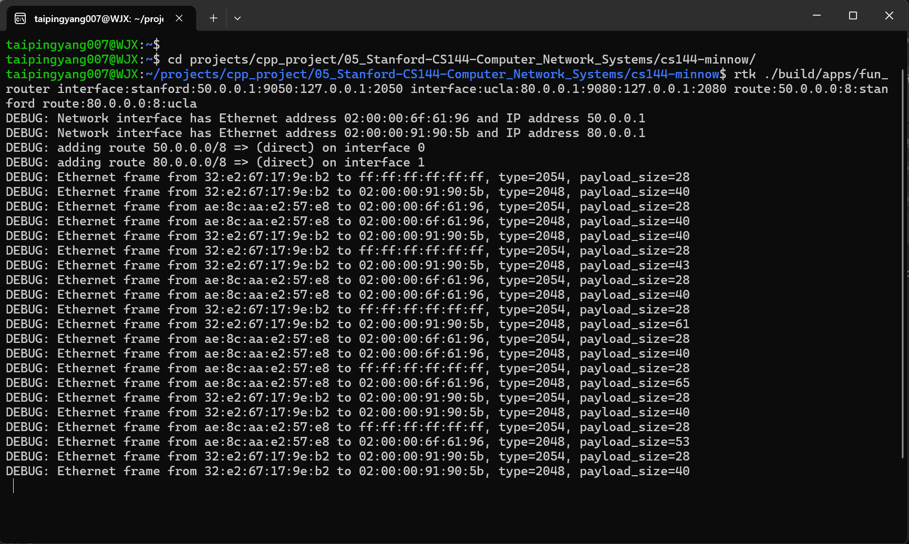
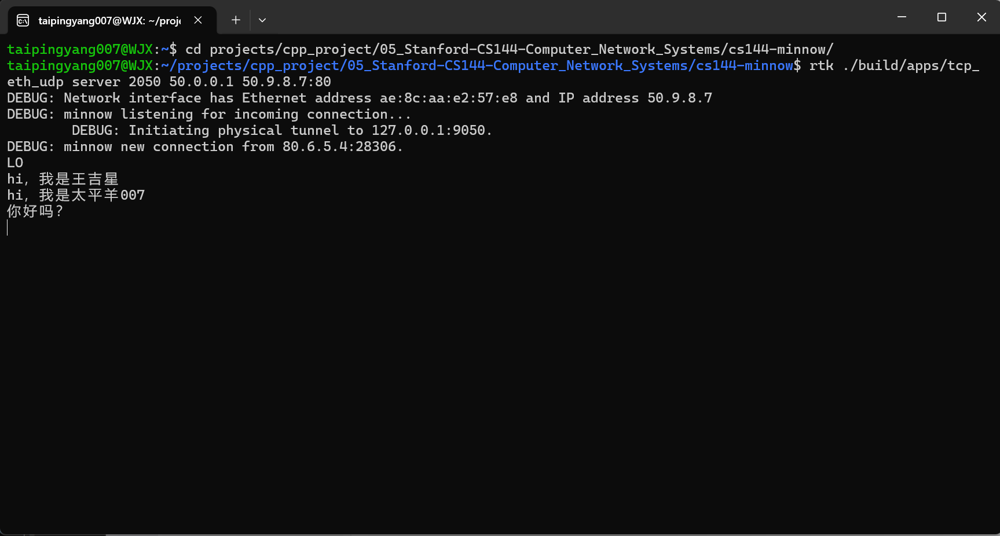
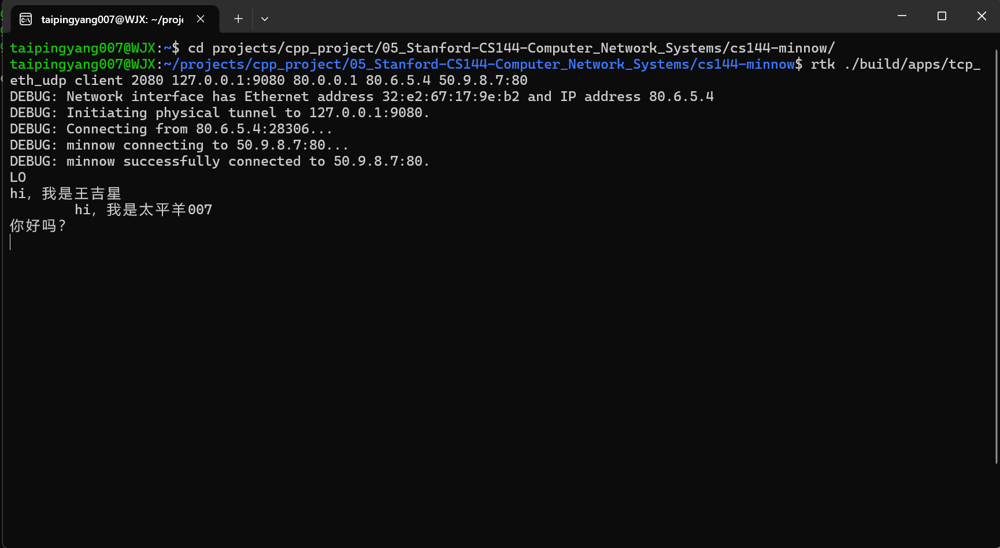

# check7 Capstone 学习笔记

> 一句话定位：`make check7` = `handouts/check7.pdf` = CS144 **checkpoint 7 / capstone**。
> **不写新核心算法**，而是把你 check0–6 写的全栈**拼起来跑真实应用**：单机重演 1969 ARPANET
> Stanford(50.9.8.7) ↔ UCLA(80.6.5.4) 经一个 fun_router 通信。
> 进度：2026-06-21 **单机 ARPANET 跑通，CS144 全栈(check0–7)实质通关 🏁**。
> 实战记录 + DEBUG 完整解读见 §8。

---

## ⚡ 一页速查（日常复习只看这半屏，要深究再翻对应 §）

- **check7 是什么**：不写新算法，把 check0–6 拼成全栈跑真应用；单机重演 1969 ARPANET。CS144 check0→7 通关 🏁。
- **套娃(§3)**：你的帧(虚拟地址 50/80)被塞进真 UDP(物理 127.0.0.1)当"货"运走；封装走两遍——里 3 层(TCP/虚拟IP/以太网)你的代码+胶水、外 2 层(UDP+物理IP)是 Linux。
- **两层地址(§4)**：虚拟=你设计、check5/6 处理、50/80 段；物理=真实、Linux 处理、127.0.0.1:端口。
- **读 DEBUG 四钥匙(§8.3)**：
  ① 只打印**路由器收到的**帧(发出的 ARP提问/转发/reply 都不打印)；
  ② 查 `from` 对身份证(`02:00:00`开头=路由器口、随机=主机；50段=斯坦福 80段=UCLA；`X.0.1`=网关、`X.具体`=主机)；
  ③ `type` 2054=ARP / 2048=IPv4；ARP 看 `to`：广播=request、单播=reply；
  ④ `size` 28=ARP、40=控制段(SYN/FIN/ACK **分不出**，标志在 TCP 头)、40+N=带 N 字节数据。
- **误区 top(§8.6)**：先查 from 别猜路由器；ARP 问下一跳不问终点；重新 ARP=**缓存过期**(30s，5x 速≈6s)不是没缓存；`size=40` 分不出 SYN/FIN/ACK。
- **完整一生(§8.5)**：握手 3 段(SYN→SYN-ACK→ACK) → 数据(40+N)+纯ACK → [停顿则缓存过期重 ARP] → 挥手 4 段(FIN→ACK→FIN→ACK，全 40)。

---

## 0. check7 性质：和前面完全不同

前面每个 check 都在写一个新算法模块。check7 **一行新核心算法都没有**——
它把端点 = check0–5、路由器 = check5×N + check6 **拼起来**，让两台虚拟机器隔着一个路由器
真的传数据。你单人自学，**只做单机版**（指导书第 4 节）；三人版 / 更大 Internet（第 6、7 节）
没同学，**跳过**。

---

## 1. 全景：check0–6 这摞积木怎么叠成一台机器

每个 check 一直都是协议栈的一层，capstone 第一次把它们**纵向叠满**：

| check | 模块 | 一句话职责 | 在收/发哪侧 | 比方 |
|---|---|---|---|---|
| 0 | **ByteStream** | 有限容量的有序字节缓冲（读/写两端） | **收发各一根** | 水管 / 蓄水池 |
| 1 | **Reassembler** | 把乱序/重叠的段拼回连续有序 | **只接收侧** | 拼图工 |
| 2 | **TCPReceiver** | 拆 TCP 段、序号 wrap/unwrap、喂 Reassembler、产 ackno+window | **只接收侧** | 收发室+回执员 |
| 3 | **TCPSender** | 从出站流取字节、切段贴序号(SYN/FIN)、重传定时器 | **只发送侧** | 发货员+催件钟 |
| 5 | **NetworkInterface** | IP数据报 ⇄ 以太网帧、ARP 查 MAC | **收发都用** | 网卡（两只手） |
| 6 | **Router** | 多网卡之间转发、最长前缀匹配 | 路由器才有 | 分拣中心 |

🔑 一句话：check0–3=可靠字节流+TCP，check5=网卡+ARP，check6=路由器。
**（无 check4：那是 measuring 测量作业，不写代码，跳过——所以表格 3 直接跳 5。）**

---

## 2. 🔑 端点是**双向**的：发送机 + 接收机两套同时跑（纠错点）

**最容易错的认知**：以为"客户端只发、服务器只收"，于是以为发送方不需要 Reassembler。**错！**

TCP 是**全双工**：同一条连接数据同时双向流。所以**每个端点**内部都同时装着：
- 一个 **TCPSender**(check3) —— 管"我发出去的流"
- 一个 **TCPReceiver**(check2，内含 check1 Reassembler) —— 管"我收进来的流"
- **两根 ByteStream**(check0) —— 出站一根、入站一根

```
        ┌──────────────── 一个端点（UCLA 客户端）────────────────┐
 你敲字 →│ 出站ByteStream → TCPSender ──→ 切段贴序号、管重传 ──┐  │
        │                                                    ▼  │
        │                                              虚拟IP+网卡 │ → 网络
        │                                                    ▲  │
 你读字 ←│ 入站ByteStream ← Reassembler ← TCPReceiver ←──────┘  │ ← 网络
        └───────────────────────────────────────────────────────┘
            ↑发送路径（上半）          ↑接收路径（下半）
```

**Reassembler 只在接收路径（下半）**：它的活是"网络把数据切成段、乱序/重复/重叠到达，我按
stream index 拼回连续有序再塞进入站 ByteStream"。发送方是**主动切段**的那个，不需要"重新拼"。

**为什么客户端"只是发"也要全套接收路径？**
1. **要收 ACK**：你 check3 的重传定时器靠收到 ACK 才知道"对方收到了、可清缓冲"。没接收路径，
   Sender 会以为全丢、疯狂重传。
2. **对方会回数据**：双向聊天时对面也往回发字节，收这些就要 Reassembler 拼接。

> 收发归属速记：ByteStream / NetworkInterface = 收发共用；Receiver+Reassembler = 纯接收；
> Sender = 纯发送。check2 和 check3 是镜像的两半。

---

## 3. 🔑🔑 套娃：IP-in-Ethernet-in-UDP-in-IP（check7 最烧脑，封装走两遍）

### 寄快递比方（不用任何术语）

你在 UCLA 想给斯坦福寄 "LO"：
1. **第一遍封装（你的代码 check0–6 干的）**：写好 "LO" 装进信封，信封写虚拟地址 **"斯坦福 50.9.8.7"**。
   产出一个写着虚拟地址的成品（最终是一个**以太网帧**）。
2. **问题**：快递公司（Linux）**不认识"斯坦福"**，只认识真门牌 **"127.0.0.1 的 2050 号窗口"**。
   这封信直接交出去寄不掉。
3. **第二遍封装（Linux 干的）**：把**整封信原封不动塞进一个快递箱**，箱外贴真门牌 **"127.0.0.1:2050"**。
4. 快递员（Linux UDP）只看箱子外面的真门牌送达。收件人拆箱取出信，看信封"斯坦福"才进虚拟世界。

```
你的成品(第一遍): [信封"斯坦福" | "LO"]            ← 一封完整的信（=以太网帧 📦）
                          │  整封信塞进快递箱
Linux成品(第二遍): [快递单"127.0.0.1:2050" | ★整封信📦★]  ← 信变成箱子里的"货"
```

### 用真实字节看一眼（眼见为实）

check5 做出的以太网帧 serialize 后是一长串字节，记成 📦：
```
📦 = [以太网头 | 虚拟IP头 50→80 | TCP头 | "LO"]        ← check5 成品 = "那封信"
```
Linux 发它时把整个 📦 当 UDP 的 payload：
```
[物理IP头 127.0.0.1 | UDP头 端口2050 | 📦 ]            ← 整个 📦 原样塞进来当"货"
```
**上面一整个 📦，原封不动变成下面 UDP 箱子里的货。这就是套娃。**

### 关键认知

- **以太网帧在第一遍是"链路层的帧"；到第二遍里只是 UDP 的"应用数据/货"**。Linux 不拆开看里面写啥。
- **"信的最底层 = 快递的最顶层"**：你那封信封好后自己飞不出去（没真网线），唯一出路是**降格成
  快递公司的一件普通货物**，借快递公司的真车送走。
- 套娃从里到外（UCLA→Stanford 一个包）：
  ```
  ["LO"] → TCP段(check2/3) → 虚拟IP(src80.6.5.4 dst50.9.8.7) → 以太网帧(虚拟MAC,check5)
        → UDP(Linux真socket,帧被serialize塞payload) → 物理IP(127.0.0.1+真端口,Linux)
  ```
  **里 3 层**(TCP段/虚拟IP/以太网帧)是你的代码+课程胶水；**外 2 层(UDP + 物理IP)都是 Linux**——你不碰。
  （与 §3.6"虚拟栈三层、serialize 3 次"一致：虚拟栈=你那 3 层，物理栈=Linux 那 2 层。）

---

## 3.5 🔑 类型关系图：这一摞 C++ 类型怎么套（套娃落到代码）

### 五组零件
- **地基件（原子）**：`Buffer`(一段字节)、`Address`(IP地址+可选端口)、`EthernetAddress`(=`array<uint8_t,6>`, MAC)
- **头件（一层的元信息）**：`EthernetHeader{dst,src:EthernetAddress; type}`、`IPv4Header{src,dst:u32 IP; ttl; proto; checksum...}`
- **整体件（头+货=一层完整的包）**：`EthernetFrame{header; payload:vector<Buffer>}`、`InternetDatagram`(=`IPv4Datagram`)`{header; payload:vector<Buffer>}`
- **内容件**：`TCPMessage{sender:TCPSenderMessage; receiver:TCPReceiverMessage}`（CS144 概念，一条 TCP 消息）
- **行为件（操作数据的"机器"，不是数据）**：`NetworkInterface`(check5)、`Router`(check6)

### 套娃嵌套（类型版）
```
EthernetFrame                                          [ethernet_frame.hh]
 ├ header: EthernetHeader { dst,src=EthernetAddress(MAC); type=IPv4/ARP }   ← 组合
 └ payload: vector<Buffer> ──parse──▶ InternetDatagram                      [ipv4_datagram.hh]
                                       ├ header: IPv4Header{ src,dst=虚拟IP(u32); ttl; checksum } ← 组合
                                       └ payload: vector<Buffer> ──parse──▶ TCP段 ─▶ TCPMessage{sender,receiver}
```
`EthernetFrame` 和 `InternetDatagram` 长得**一模一样**：都是 `{ Header header; vector<Buffer> payload; }`。
**套娃在代码里 = "头+货"这个模式层层重复。**

### 🔑🔑 两种"关系"别混（核心）
1. **组合 has-a（真持有对象）**：`EthernetFrame` 真持有一个 `EthernetHeader` → `frame.header.dst` 能直接点出来。
2. **序列化嵌套（payload 装的是字节，不是对象！）**：`frame.payload` 类型是 `vector<Buffer>`(纯字节)，
   **不是** `InternetDatagram` 对象。上一层不直接持有下一层对象，只持有它 `serialize` 出的一坨字节。
   想看下一层 **必须 `parse`**。
   → 这就是 `read()` 里每下一层都要 `parse`、`recv_frame` 内部也要 `parse` 的原因：payload 只是 Buffer 字节，
   不能直接 `.` 点进去。**serialize=往下装箱、parse=往上拆箱，是层与层之间唯一的桥。**

### 行为件的输入输出
| 行为件 | 吃什么 | 吐什么 | 持有的状态 |
|---|---|---|---|
| `NetworkInterface`(check5) | `send_datagram(InternetDatagram, next_hop:Address)` / `recv_frame(EthernetFrame)` | `EthernetFrame`(经 OutputPort) / `InternetDatagram`(进 `datagrams_received_`) | 自己虚拟IP(`Address`)、自己MAC(`EthernetAddress`)、ARP表、OutputPort |
| `Router`(check6) | 各网卡的 `datagrams_received()` | 调 `interface(n).send_datagram(...)` | `vector<NetworkInterface>` |

### `Address` 一型两用（呼应两层地址）
`Address` 这**一个类型**虚拟/物理世界都用，只是**值不同**：NetworkInterface 的 `ip_address_`(虚拟 50.0.0.1)
是 Address；UDP 的 `physical_dest_`(物理 127.0.0.1:2050)也是 Address。**同型不同值 = 两层地址在代码里的长相。**

### `unwrap_tcp_in_ip` / `wrap_tcp_in_ip`（read/write 用的胶水）
`util/tcp_over_ip.hh`，**课程给的，不是你写的**。`wrap_tcp_in_ip(TCPMessage)→InternetDatagram`(套虚拟IP头)；
`unwrap_tcp_in_ip(InternetDatagram)→optional<TCPMessage>`(拆出 TCP 内容)。互为逆，是套娃 TCP↔虚拟IP 那一层的桥。

---

## 3.6 🧭 嵌套记不住怎么办：别背字段，记"一个模式 + 三条规则"现场推

**心态**：这些层和字段**不是用来背的**。没人背得住每层有哪些字段，专家也现场推。记 4 样东西即可。

**一个模式**（协议栈每一层无一例外）：
```
每一层 = { header（这层"谁发谁收"） + payload（下一层的字节，vector<Buffer>） }
```
（`EthernetFrame` 和 `InternetDatagram` 一模一样就是证据。）

**三条规则**：
1. 想往里看一层 → `parse`（字节→对象）；想往外包一层 → `serialize`（对象→字节）。
2. `payload` 永远是字节(`vector<Buffer>`)，**不是对象**，不能直接 `.` 点进去。
3. 每层 header 装"这层谁发谁收"：以太网层 MAC↔MAC，IP 层 IP↔IP。

**现场推导三连问**（遇到任何嵌套就问自己）：
> ① 我要的东西在**哪一层**？ ② 那层在不在我手上对象的 `payload` 里？ ③ 是字节就**先 `parse`**。

**范例：为什么不能 `frame.payload.header.dst` 读虚拟IP**
- 虚拟IP在 IP 层(下一层)的 header（规则3）→ 下一层在 `frame.payload` 里，但那是字节(规则2)，
  `vector<Buffer>` 没有 `.header`，编译都过不了 → 必须先 `parse` 成 `InternetDatagram`(规则1) 再 `dgram.header.dst`。
- 注：`read()` 里没看到这个 parse，因为它在你 check5 写的 `recv_frame` 内部做了；app 拿到的已是拆好的 `dgram`。

**虚拟栈是三层（别漏最里的 TCP）→ serialize 3 次 / parse 3 次，完全对称**：
```
TCPMessage("LO")  →塞进→  InternetDatagram(IP头+TCP字节)  →塞进→  EthernetFrame(eth头+IP字节)  →  上网线
```
| 发送 serialize | 在哪 | 接收 parse | 在哪 |
|---|---|---|---|
| #1 TCP段→字节(进IP.payload) | `wrap_tcp_in_ip` 内 | #1 字节→以太网帧 | `read()` 第76行 |
| #2 IP数据报→字节(进帧.payload) | check5 `send_datagram` 内 | #2 帧.payload→IP数据报 | check5 `recv_frame` 内 |
| #3 以太网帧→字节(交UDP) | `transmit` 里 `serialize(x)` | #3 数据报.payload→TCP消息 | `unwrap_tcp_in_ip` 内 |
| (之后 UDP+物理IP 是 Linux 的活) | — | (之前 UDP 拆壳是 Linux) | — |
口诀：**装箱几层、拆箱就几层**；这里 3 层 → 各 3 次。

### 读不懂 app 代码时的实用招：先扫变量名，别逐字抠
CS144 变量名很诚实：`virtual_*` / `physical_*` 直接告诉你属于哪一层。
例 `fun_router.cc` 一条 `interface:stanford:50.0.0.1:9050:127.0.0.1:2050`：
`virtual_addr=50.0.0.1`(进 NetworkInterface 当网卡 IP) / `physical_local_port=9050`+`physical_dest=127.0.0.1:2050`(进 UDP socket)。
→ 虚拟给你的 check5，物理给 Linux UDP。**`structured binding` `auto& [a,b,c]=tie(...)` = 把一坨东西拆成几个有名字的变量，方便读。**

---

## 4. 两层 IP 地址：两个叠在一起的网络（必背对照表）

| | **虚拟地址(virtual)** | **物理地址(physical)** |
|---|---|---|
| 长啥样 | `50.9.8.7`、`80.6.5.4`、`50.0.0.1`、`80.0.0.1` | `127.0.0.1` + UDP 端口(2050/2080/9050/9080) |
| 谁发明的 | **你**，凭空设计的 ARPANET 拓扑 | 真实存在，Linux 能直接送达 |
| 谁来处理 | **你的代码**（check5 ARP / check6 路由） | Linux 内核 UDP/IP 栈 |
| 类比 | 信封上"斯坦福/UCLA"的设定地址 | 快递箱上的真实门牌 |
| 在套娃哪层 | 内层（被包着的"信"） | 最外层（运信的"快递箱"） |

> 直觉：**虚拟地址是"剧本里要去哪"，物理地址是"现实里这张纸现在递给谁"。**

---

## 5. 套娃的作用和意义（设计哲学，别只答"为了过测试"）

1. **让没有真网卡的虚拟帧能动起来（给它一双腿）**：你电脑没第二张网卡/真链路，虚拟帧本身飞不出
   进程。Linux 的 UDP 是唯一能真正搬字节的工具 → 借 UDP 当腿。
2. **一台电脑装下"一整个互联网"**：每条虚拟网线 = 一条 UDP 通道，想要几条链路开几个 UDP 端口，
   任意拓扑全在一台笔记本里。`fun_router` 两张网卡 = 两个 UDP 端口(9050/9080) 假装的。
3. **虚拟和物理解耦（最关键）**：虚拟地址你随便设计、不撞真实 IP；物理传输交给成熟的 Linux。
   🔑 你的 check5/6 **完全不知道**脚下是 UDP 还是真网卡——`OutputPort::transmit` 单测里是"假"的
   （只记录），capstone 里换成"真"的（发 UDP，见 `apps/tcp_eth_udp.cc:133`），**你的实现一行没改**。
   → 同一套栈，换底座就能跑真网卡。

> 收口：**套娃 = 用一台电脑、借 Linux 的真 UDP，搭出一个你随便设计、却跑着真 TCP/IP 的迷你
> 互联网，而你的代码不用为"它其实在 UDP 上"操半点心。** 这就是工业界的"网络仿真(emulation)"：
> 不是模拟 TCP 的样子，而是让**真 TCP** 跑在**仿真的网线**上。check7 是**真实的 TCP/IP 通信**。

---

## 6. 拓扑与运行（4 终端实验，单机版第4节）

虚拟拓扑：
```
UCLA客户端 80.6.5.4 ──[ucla链路]── fun_router ──[stanford链路]── Stanford服务器 50.9.8.7:80
  默认路由 0/0→80.0.0.1     网卡 80.0.0.1 / 50.0.0.1     默认路由 0/0→50.0.0.1
                           路由表 50/8→stanford, 80/8→ucla
```

| 终端 | 跑什么 | 角色 | 对应代码 |
|---|---|---|---|
| ① | `sudo tshark -ni lo -d udp.port==2080,eth 'port 2080'`（WSL 未装，已跳过） | 监控嗅探（看 TCP 标志要靠它） | 无 |
| ② | `fun_router interface:... route:...` | 路由器 | check6 + 2×check5 |
| ③ | `tcp_eth_udp server 2050 50.0.0.1 50.9.8.7:80` | Stanford 服务器 | check0–5 全栈 |
| ④ | `tcp_eth_udp client 2080 127.0.0.1:9080 80.0.0.1 80.6.5.4 50.9.8.7:80` | UCLA 客户端 | check0–5 全栈 |

> 彩蛋：`LO` 是真实历史——1969 年 UCLA 想发 `LOGIN`，系统打到 `LO` 就崩了，人类第一条网络消息就是 "LO"。

---

## 7. 攻关进度

五幕全部完成 ✅（概念 → 精读源码 → 编译 → 环境 → 实跑+读DEBUG）；第六幕 something creative 选做未做。

---

## 8. 🏁 实战记录 + DEBUG 完整解读（2026-06-21 单机跑通）

### 8.1 跑通记录
**环境**：WSL，tshark 未装但**跳过**(只是监控窗，非必需)；用 `fun_router` 自带 `DEBUG: Ethernet frame...` 当"穷人版 tshark"。3 终端。

**启动顺序**(都 `rtk` 包裹，fun_router 一整行)：
```
# 终端A 路由器(最先，当"网线")
rtk ./build/apps/fun_router interface:stanford:50.0.0.1:9050:127.0.0.1:2050 interface:ucla:80.0.0.1:9080:127.0.0.1:2080 route:50.0.0.0:8:stanford route:80.0.0.0:8:ucla
# 终端B Stanford 服务器
rtk ./build/apps/tcp_eth_udp server 2050 50.0.0.1 50.9.8.7:80
# 终端C UCLA 客户端，起完在这敲字
rtk ./build/apps/tcp_eth_udp client 2080 127.0.0.1:9080 80.0.0.1 80.6.5.4 50.9.8.7:80
```
结果：client `successfully connected to 50.9.8.7:80`，server `new connection from 80.6.5.4`，双向收发 "LO" + 中文，全双工/UTF-8/Reassembler 全 OK。

实况截图（VSCode `Ctrl+Shift+V` 预览）：




### 8.2 读 DEBUG 前提：三个进程，各打印各的（物理 vs 虚拟）
- **物理(真实)**：一台 WSL 三进程——A=`fun_router`(UDP 9050/9080)、B=`server`(UDP 2050)、C=`client`(UDP 2080)，靠 `127.0.0.1` UDP 互发。
- **虚拟(假装)**：三台隔网络的机器 `UCLA客户端(80.6.5.4) ─链路─ 路由器 ─链路─ Stanford服务器(50.9.8.7)`。链路=想象的网线，实为 loopback UDP 模拟。
- 🔑 **每个进程只打印自己的网卡/路由**。截图是终端A(路由器)→ 只有路由器 2 网卡 + 2 路由，**没有客户端网卡**(它打在终端C)。
  看几行 Network interface：端点 1 行(1张网卡)、路由器 2 行(2张网卡)。

### 8.3 读一行 DEBUG 的「四把钥匙」
一行格式：`Ethernet frame from <源MAC> to <目的MAC>, type=<类型>, payload_size=<字节>`

**钥匙①：DEBUG 只打印「路由器收到的」帧**（打印点在 recv 回调 `fun_router.cc:201-217`）。
→ 每行 = 有人发帧给路由器；`from`=发给路由器的机器，`to`=路由器某口(或广播)。
**路由器自己发出的帧(ARP提问、转发包、reply)不打印** → 你看得到"答案"看不到路由器的"提问"。

**钥匙②：身份证表**（开头 `Network interface has ... ` 行 + server/client 终端同款行凑齐四张）：

| MAC | 是谁 | 虚拟IP |
|---|---|---|
| `02:00:00:6f...` | 路由器 **stanford 口**(interface 0) | 50.0.0.1 |
| `02:00:00:91...` | 路由器 **ucla 口**(interface 1) | 80.0.0.1 |
| `ae:8c:aa...`(随机) | Stanford 服务器主机 | 50.9.8.7 |
| `32:e2:67...`(随机) | UCLA 客户端主机 | 80.6.5.4 |
> 🔑 `02:00:00:` 开头 = 路由器的口(`random_router_ethernet_address` 焊死前三字节)；随机的=主机网卡。
> IP 段认归属：50 段=斯坦福，80 段=UCLA。

**钥匙③：`type`**：`2054`=ARP(0x806)、`2048`=IPv4(0x800)。
ARP 再看 `to`：`to ff:ff:ff:ff:ff:ff`(广播)=**request**("你MAC多少?")；`to 具体MAC`(单播)=**reply**("我MAC是X")。

**钥匙④：`payload_size` 反推内容**（固定格式常量，不用背）：
| size | 是什么 | 来历 |
|---|---|---|
| 28 | ARP 消息 | `ARPMessage::LENGTH`=28(check5) |
| 40 | TCP 控制段(SYN/ACK/FIN/纯ACK，无数据) | IP头20(check6) + TCP头20(check2/3) |
| 40+N | 带 N 字节数据 | 如 43=40+3="L""O""↵" |

### 8.4 ⚠️ 重要局限：`size=40` 分不出 SYN / FIN / ACK
**SYN/FIN/ACK 标志都在 TCP 头的标志位里，不占 payload**；而 DEBUG 只打 `payload_size`，**看不到 TCP 标志位**。
所以握手的 SYN/SYN-ACK/ACK、挥手的 FIN、纯 ACK —— 在 DEBUG 里**全是 `size=40`，长得一模一样**。
→ 想区分只能靠"连接处在哪个阶段"推，或用 **tshark 解 TCP 标志位**。（这就是你"看不出挥手"的原因——FIN 伪装成普通 40 字节段。）

### 8.5 ★ 一条连接的完整一生（客户端发起，我按规则推的典型序列）
```
身份证：C=客户端 32:e2:67/80.6.5.4 ｜ Ru=路由器ucla口 02:00:00:91/80.0.0.1
        Rs=路由器stanford口 02:00:00:6f/50.0.0.1 ｜ S=服务器 ae:8c:aa/50.9.8.7
（✅=router终端打印；❌=路由器自己发出的，不打印。ARP 总是"一问一答"两帧，"答"由路由器发出时就 ❌）

━━ 阶段1：三次握手（初次，ARP 缓存全空）━━
A. from C  to ff:ff  ARP 28  ✅ C广播问网关Ru的MAC（request）
   〔from Ru to C        ❌ Ru 回 reply；C 学到 Ru 的 MAC〕
B. from C  to Ru     IP  40  ✅ C发SYN（握手①）
   〔路由器查表50/8→Rs口；from Rs to ff:ff ❌ Rs广播问S；S 借此 request 白嫖学到 Rs 的 MAC〕
C. from S  to Rs     ARP 28  ✅ S回reply（单播，告诉路由器自己MAC）
   〔路由器转发SYN给S      ❌〕
D. from S  to Rs     IP  40  ✅ S发SYN-ACK（握手②）
   〔路由器转发SYN-ACK给C  ❌〕
E. from C  to Ru     IP  40  ✅ C发ACK（握手③）→ 连接建立！
   〔路由器转发ACK给S      ❌〕

━━ 阶段2：发"LO"（紧接，缓存都新鲜，全程无ARP）━━
F. from C  to Ru     IP  43  ✅ C发数据"LO"(43=40+3)
   〔路由器转发给S         ❌〕
G. from S  to Rs     IP  40  ✅ S回纯ACK确认
   〔路由器转发给C         ❌〕

━━ 阶段3：停顿>6秒后再发（缓存过期，重新ARP）━━
H. from C  to ff:ff  ARP 28  ✅ C缓存过期，重新广播问网关
   〔from Ru to C        ❌ Ru 回 reply（和 A 行同款，不打印；这就是"那个回复"）〕
I. from C  to Ru     IP  42  ✅ C发数据(42=40+2)
   〔路由器→S 缓存也过期；from Rs to ff:ff ❌ Rs 重新广播问S〕
J. from S  to Rs     ARP 28  ✅ S再回reply
   〔路由器转发数据给S      ❌〕
K. from S  to Rs     IP  40  ✅ S回纯ACK
   〔路由器转发给C         ❌〕

━━ 阶段4：Ctrl+D 关闭 → 四次挥手（承接阶段3，缓存命中；全是 size=40）━━
L. from C  to Ru     IP  40  ✅ C发FIN（挥手①，主动关）
   〔路由器转发FIN给S      ❌〕
M. from S  to Rs     IP  40  ✅ S回ACK（挥手②）
   〔路由器转发ACK给C      ❌〕
N. from S  to Rs     IP  40  ✅ S发FIN（挥手③）
   〔路由器转发FIN给C      ❌〕
O. from C  to Ru     IP  40  ✅ C回ACK（挥手④）
   〔路由器转发ACK给S      ❌〕→ 连接关闭
```
**挥手·两种缓存情况**（上面 L–O 是"缓存命中"版）：
- **缓存命中**(刚聊完立刻 Ctrl+D)：就是 L–O 四个 `size=40`，**无 ARP**。
- **缓存过期**(关之前停顿 >6s)：要发 FIN 那跳缓存没了 → C 发 FIN 前先补 `from C to ff:ff ARP 28`(重新问网关) 再发 FIN；路由器/服务器侧若也过期，各自转发前同样重新 ARP(广播 request✅ + 对方 reply✅；路由器自己发的 ❌)。
- 🔑 **ARP 只决定"发送前要不要先问路"，不改变 FIN/ACK 这 4 个段本身**——握手、传数据、挥手都遵循这条。

> 注：典型序列，真实跑可能有出入（停顿时长决定缓存是否过期；双方是否同时关；被动方 ACK+FIN 有时合并成 3 包）。
> 但"谁发 / 打不打印 / size 含义"的规律是准的。

### 8.6 ⚠️ 反复踩的坑（集中版）
1. **读 frame 先查 `from`，别猜"是路由器"**。`from 32:e2:67`=客户端发的，`from ae:8c:aa`=服务器发的。多数误读都源于没查 from。
2. **发送/接收角色不固定**：谁在哪个终端敲字谁就是发送方。在 server 终端敲 → Stanford 是发送方、方向整个反过来。
3. **ARP 问"下一跳"，不问最终目的地**(check5)。客户端问网关(Ru 80.0.0.1)、路由器问服务器(50.9.8.7)；每跳各问各的下一跳。
4. **重新 ARP 是缓存过期，不是没缓存**：三方都有 `arp_table_`(check5)；缓存 30s 过期，app 跑 5x 速→实际约 6s 过期(`tcp_eth_udp.cc:150`)。
5. **`X.0.1`=路由器的口(网关)，`X.具体`=主机**：80.0.0.1(路由器ucla口) ≠ 80.6.5.4(客户端)，同 80 段两台设备。
6. **网卡 IP ≠ 网段**：`Network interface ... 50.0.0.1` 是网卡 IP；`50.0.0.0/8`(adding route)是网段范围。
7. **`size=40` 分不出 SYN/FIN/ACK**（见 §8.4）：标志在 TCP 头、不占 payload，DEBUG 看不到。

### 8.7 两跳 + 启动 4 行（拓扑图见 §6）
- **ucla口只连UCLA侧、stanford口只连斯坦福侧**；客户端↔服务器不直连，必经路由器。客户端→服务器走**两跳**(客户端→ucla口、内部route、stanford口→服务器)，**两跳 MAC 不同 = check5"MAC每跳变、IP不变"**。
- 启动 4 行 = 路由器自报家门：前 2 行=2 张网卡(MAC+IP)；后 2 行 `adding route .../8 =>(direct) on interface N`=路由表(check6 `add_route`，`(direct)`=next_hop空=直连)。

### 8.8 挥手（四次挥手 / FIN）
- TCP 四次挥手用 **FIN**，你 check2(收FIN)/check3(发FIN)实现过。**关闭连接(`Ctrl+D`)才发 FIN**。
- 连接保持时连发多条消息**不重新握手**(握手仅建连一次)，只 `size=40` 的纯 ACK 确认。
- DEBUG 里 FIN 段也是 `size=40`，肉眼分不出（§8.4），要看 TCP 标志得上 tshark。

### 8.9 check7 收官说明
- check7 **无 `make check` 自动评分**：验收 = ①跑通(✅) ②写 report(自学不交则省)。单人版"跑通+读懂DEBUG"= 实质验收。
- 跳过(无同学)：三人版、更大 Internet。可选未做：something creative。
- **CS144 lab check0→7 到此实质全部通关。** 🏁

---

## 自测题（第 1 轮 · 全景 + 双向栈）

1. check7 和前面的 check 性质有什么本质不同？
2. 一个 TCP 端点内部装了哪几套东西？Reassembler 在收路径还是发路径？为什么发送方不需要它？
3. UCLA 客户端"只是发数据"，为什么也必须有完整的接收路径？（两个理由）

<details><summary>参考要点</summary>

1. 前面每个 check 写一个新算法模块；check7 不写新核心算法，把 check0–6 拼成全栈跑真实应用。
2. Sender(check3)+Receiver(check2,含 Reassembler)+两根 ByteStream(出站/入站)。Reassembler 在
   **接收**路径——发送方是主动切段的那个，不需要重新拼。
3. ①要收 ACK，否则 check3 重传定时器以为全丢、疯狂重传；②对方会回数据，收这些要 Reassembler 拼接。

</details>

## 自测题（第 2 轮 · 套娃 + 两层地址）

1. 快递员(Linux UDP)送箱子时会不会看箱里那封信写"斯坦福"还是"UCLA"？为什么？
2. 以太网帧在第一遍是链路层的帧，到第二遍(物理栈)里扮演哪一层？"信的底=快递的顶"什么意思？
3. 虚拟地址和物理地址分别谁发明、谁处理、在套娃哪一层？
4. 套娃的三大作用是什么？为什么说你的 check5/6 代码"不知道自己跑在 UDP 上"？

<details><summary>参考要点</summary>

1. 不会。它只看最外层真门牌 127.0.0.1:2050，里面写啥不管（那是被封装进 payload 的"货"）。
2. 扮演 UDP 的"应用数据/货(payload)"。你那封信自己飞不出去（没真网线），唯一出路是降格成快递
   公司的普通货物借真车送走——信世界的尽头就是快递世界的开头。
3. 虚拟=你发明、你的代码(check5/6)处理、内层；物理=真实存在、Linux 处理、最外层。
4. ①给虚拟帧一双腿(借UDP搬字节) ②一台电脑装下整个互联网(任意拓扑) ③虚拟物理解耦。
   因为 `OutputPort::transmit` 是抽象接口，单测里是"假"的只记录、capstone 里换"真"的发 UDP，
   你的实现一行没改——同一套栈换底座就能跑真网卡。

</details>

## 自测题（第 3 轮 · 读 DEBUG / 完整一生）

1. 读一行 frame 的第一步是什么？为什么 `from ae:8c:aa` 那行不是路由器发的？
2. 为什么 DEBUG 里看不到"路由器把 SYN 转给服务器"那一跳？
3. 客户端发数据前又冒出一条 ARP request，是"没缓存"还是别的？背后是你哪个 check 的什么逻辑？
4. 挥手的 FIN 段在 DEBUG 里 size 是多少？为什么和普通 ACK 分不出？怎么才能看出 FIN？
5. `80.0.0.1` 和 `80.6.5.4` 是同一台设备吗？`50.0.0.1` 和 `50.0.0.0/8` 是一回事吗？

<details><summary>参考要点</summary>

1. 先查 `from` 对身份证表。`ae:8c:aa`=服务器 → 这帧是服务器发的（DEBUG 只打印路由器收到的帧，from 就是发给路由器的那台机器）。
2. 因为那是**路由器自己发出**的帧，DEBUG 只打印"路由器收到的"，发出的(ARP提问、转发、reply)都不打印。
3. 是**缓存过期**不是没缓存。三方都有 `arp_table_`(check5)；缓存 30s 过期，5x 速下约 6s。这是你 check5 `tick` 写的过期逻辑被真实触发。
4. `size=40`，和 SYN/ACK/纯ACK 一样——因为 FIN 标志在 TCP 头、不占 payload，DEBUG 只显示 payload_size。要看 FIN 标志得用 tshark。
5. 不是同一台：80.0.0.1=路由器 ucla 口(网关)、80.6.5.4=客户端主机，同 80 段两台设备。50.0.0.1=网卡 IP、50.0.0.0/8=网段范围，不是一回事。

</details>
